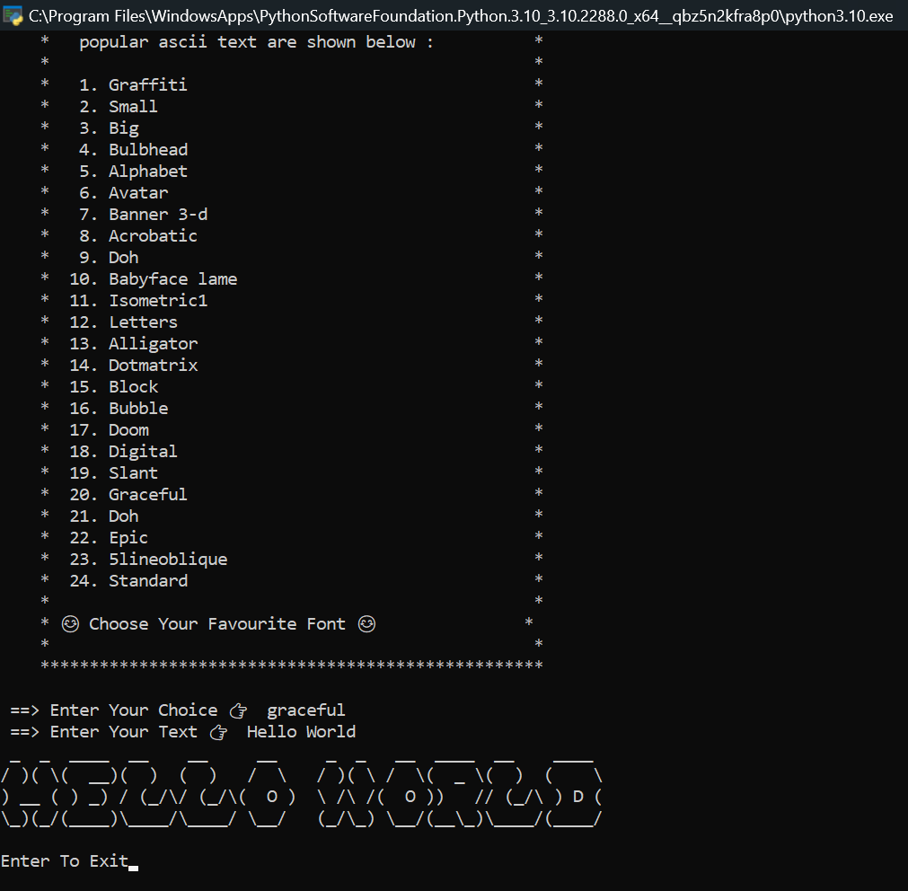

<h1><b> ASCII ART </b></h1>
<h2><i>ASCII art is a graphic design technique that uses computers for presentation and consists of pictures pieced together from the 95 printable characters defined by the ASCII Standard from 1963 and ASCII compliant character sets with proprietary extended characters.</i></h2>

#
    <a href="https://taguar258.github.io/Raven-Storm/INSTALLATION"> 
#
<h3><b>Ascii banner generator output :</h3></b>

##

#

<h1 align="left"><b>Support 👇👇👇 </b></h1>
  
